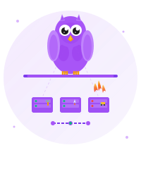

<div align="center">


<p align="center">
  <a href="https://github.com/0xdsqr/nixos-config"></a>
  <a href="#"></a>
  <a href="#"></a>
</p>

**Modular, portable NixOS/nix-darwin configuration for homelab servers and development machines.**

*A flake-based setup with shared modules and zero configuration drift.*
</div>

## Why This Exists

I got tired of my machines drifting apart. Spend a week setting up Neovim on my Mac, then have to remember what I did when I spin up a new VM. Copy dotfiles around, forget packages, realize my Git config is different everywhere. It sucked.

## Machines

| Machine | Platform | Purpose |
|---------|----------|---------|
| devbox-macbook-pro-m1 | Darwin | Daily driver |
| dsqr-mini-001 | Darwin | Mini cluster node |
| dsqr-mini-002 | Darwin | Mini cluster node |
| devbox-vm-x86_64 | NixOS | Development VM |
| devbox-usb-x86_64 | NixOS | Portable USB install |
| gateway-vm-x86_64 | NixOS | Network gateway |
| dsqr-server-vm-x86_64 | NixOS | Main homelab server |
| cellar-vm-x86_64 | NixOS | Storage/backup |
| media-server-vm-x86_64 | NixOS | Media services |
| github-runner-vm-x86_64 | NixOS | CI runner |

## Mini Cluster

The mini cluster is a set of Mac Minis running a shared nix-darwin configuration for distributed AI inference.

**What's included:**
- **exo** - Distributed LLM inference, auto-discovers nodes on the network, pools compute across devices
- **ollama** - Local model runner
- **opencode** - AI coding assistant CLI
- Headless-optimized: SSH enabled, never sleeps, Wake-on-LAN, auto-restart on power failure

**How it works:**
- All minis share the same `dsqr-mini-cluster` nix-darwin module
- Each mini runs exo as a launchd daemon (starts on boot)
- Nodes auto-discover via mDNS - just plug in and run `just switch-mini`
- Access the cluster dashboard from any machine: `http://dsqr-mini-001.local:52415`
- Models are sharded across nodes, enabling larger models than any single device

**Adding a new mini:**
1. Add it to `flake.nix`: `dsqr-mini-XXX = mkMiniDarwin { };`
2. Follow the setup steps below

## Quick Start

**Prerequisites:** Nix with flakes enabled

```bash
# Clone
git clone https://github.com/0xdsqr/nixos-config.git ~/.config/nixos-config
cd ~/.config/nixos-config

# Set your machine name in Justfile (line 5)
# NIXNAME := "your-machine-name"

# Apply
just switch
```

**macOS users:** Install nix-darwin first with `nix run nix-darwin -- switch --flake ~/.config/nixos-config`

## What is eevee?

**eevee** is a portable home-manager module that gives you a complete CLI dev environment:

- **Neovim 0.11+** - Native LSP (TypeScript, Go, Python, Nix), no Mason/plugin managers
- **Git + GPG** - Commit signing configured with your name/email
- **Zsh + Starship** - Custom purple prompt with syntax highlighting
- **Tmux** - Terminal multiplexing with Space prefix
- **Direnv** - Automatic nix-direnv integration

```nix
eevee = {
  full_name = "Your Name";
  email_address = "you@example.com";
  theme = "tokyo-night";
};
```

## Using as a Module

Import into your own flake:

```nix
{
  inputs.dsqr-nix.url = "github:0xdsqr/nixos-config";

  outputs = { nixpkgs, dsqr-nix, ... }: {
    nixosConfigurations.my-machine = nixpkgs.lib.nixosSystem {
      modules = [
        (dsqr-nix.nixosModules.dsqr-nix inputs)
        {
          home-manager.users.myuser = {
            imports = [ (dsqr-nix.homeManagerModules.eevee inputs) ];
            eevee = {
              full_name = "Your Name";
              email_address = "you@example.com";
              theme = "tokyo-night";
            };
          };
        }
      ];
    };
  };
}
```

## Commands

```bash
just switch    # Build and activate configuration
just test      # Test without activating
just format    # Format all Nix files
just clean     # Garbage collect old generations
```

Override machine per-command: `NIXNAME=gateway-vm-x86_64 just switch`

## Mini Cluster Setup (Mac Minis)

Fresh Mac Mini setup for the mini cluster. Run these **outside** of nix develop.

### Prerequisites

```bash
# 1. Set hostname (replace XXX with your mini number: 001, 002, etc.)
sudo scutil --set HostName dsqr-mini-XXX
sudo scutil --set LocalHostName dsqr-mini-XXX
sudo scutil --set ComputerName dsqr-mini-XXX

# 2. Install Homebrew (required for nix-darwin)
/bin/bash -c "$(curl -fsSL https://raw.githubusercontent.com/Homebrew/install/HEAD/install.sh)"

# 3. Install Determinate Nix
curl --proto '=https' --tlsv1.2 -sSf -L https://install.determinate.systems/nix | sh -s -- install

# 4. Reboot after Nix install
sudo reboot
```

### After Reboot

```bash
# 5. Install Xcode from App Store (required for Metal/MLX)
open "macappstores://apps.apple.com/app/xcode/id497799835"

# 6. After Xcode installs, configure it and download Metal toolchain
sudo xcode-select -s /Applications/Xcode.app/Contents/Developer
sudo xcodebuild -license accept
sudo xcodebuild -downloadComponent MetalToolchain

# 7. Export Metal toolchain to nix store
#    Run this first to see the actual DMG path:
ls /System/Library/AssetsV2/com_apple_MobileAsset_MetalToolchain/

#    Then use that path (example below, yours will differ):
hdiutil attach "/System/Library/AssetsV2/com_apple_MobileAsset_MetalToolchain/0bc538ab0cfa107625f77ad7bcfa566abe43e917.asset/AssetData/Restore/022-20660-054.dmg" -mountpoint /private/tmp/metal-dmg
cp -R /private/tmp/metal-dmg/Metal.xctoolchain /private/tmp/metal-export
hdiutil detach /private/tmp/metal-dmg
nix nar pack /private/tmp/metal-export > /private/tmp/metal-toolchain-17C48.nar
nix store add --mode flat /private/tmp/metal-toolchain-17C48.nar
```

### First Switch

```bash
# 8. Clone and enter repo
git clone https://github.com/0xdsqr/nixos-config.git ~/nixos-config
cd ~/nixos-config

# 9. Rename any conflicting /etc files (nix-darwin will manage these)
sudo mv /etc/bashrc /etc/bashrc.before-nix-darwin 2>/dev/null || true
sudo mv /etc/zshrc /etc/zshrc.before-nix-darwin 2>/dev/null || true
sudo mv /etc/zshenv /etc/zshenv.before-nix-darwin 2>/dev/null || true

# 10. Enter dev shell and switch
nix develop
just switch-mini
```

### Subsequent Updates

```bash
cd ~/nixos-config
git pull
nix develop
just switch-mini
```

### Verify Installation

```bash
# Check exo and ollama are installed
which exo
which ollama

# Start exo (dashboard at http://localhost:52415)
exo

# In another terminal, start ollama
ollama serve

# Pull a model
ollama pull llama3.2:3b

# Test chat
ollama run llama3.2:3b "Hello, what can you do?"
```

### Exo Cluster Test

With multiple minis on the same network, exo auto-discovers them:

```bash
# On each mini, just run:
exo

# Open http://localhost:52415 in browser to see cluster UI
# All nodes should appear automatically via mDNS

# Run a model across the cluster
curl -X POST http://localhost:52415/v1/chat/completions \
  -H 'Content-Type: application/json' \
  -d '{
    "model": "llama-3.2-3b",
    "messages": [{"role": "user", "content": "Hello!"}]
  }'
```

## Documentation

- **[.github/assets/modules.md](./.github/assets/modules.md)** - Full API reference for eevee, dsqr-nix, and dsqr-proxmox modules
- **[.github/assets/secrets.md](./.github/assets/secrets.md)** - SOPS/age secrets management guide

## Development

```bash
nix develop    # Enter dev shell with formatters/linters
nix fmt        # Format all files (Nix, TypeScript, JavaScript)
```

## License

MIT
